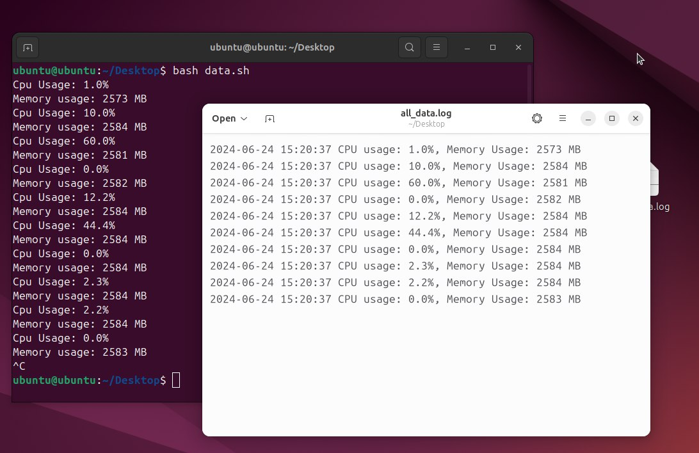

# System Monitoring with Notifications

This project implements a system monitoring solution for tracking system metrics (CPU, memory) using Bash scripts for data collection and Python for analysis and alert notifications via email.



## Description

The project consists of two main components:

1. **Bash scripts for data collection:**
   - The `data.sh` script collects CPU load & memory usage data using `top`and `free` utilities.
   - Data is logged into the `all_data.log` file.

2. **Python script for analysis and notifications:**
   - The `analysis.py` script reads data from `all_data.log`, analyzes it, and sends notifications if values exceed predefined thresholds.
   - Notifications can be sent via email.
3. **.env configuration using disposable email:**
   ```
   SMTP_SERVER=smtp.lisoren.com
   SMTP_PORT=25
   SMTP_USER=
   SMTP_PASSWORD=
   FROM_EMAIL=welen73507@lisoren.com
   TO_EMAIL=welen73507@lisoren.com
   CPU_THRESHOLD=80.0
   MEMORY_THRESHOLD=3024
   LOG_FILE_PATH=/home/ubuntu/Desktop/all_data.log
   ```

## Usage

- The container will continuously monitor system performance.
- Alerts are sent via disposable email if CPU or memory usage exceeds thresholds.

## Skills Utilized
- Data Collection
- Bash Scripting
- Python
- Docker
- API Integration
